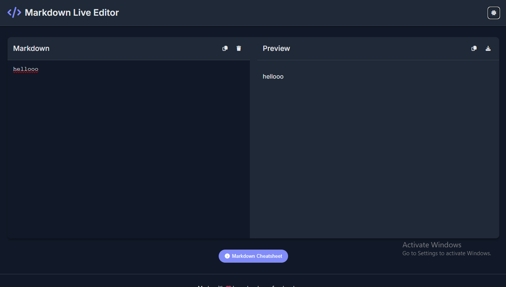

# Markdown Live Editor

A lightweight, responsive Markdown editor with live preview functionality.

## Features

- ✨ **Real-time Preview** - See your Markdown rendered instantly as you type
- 🌓 **Dark/Light Mode** - Toggle between themes for comfortable editing
- 💾 **Auto-Save** - Content is automatically saved in your browser's local storage
- 📋 **Copy Options** - Copy your Markdown or the generated HTML with one click
- 📥 **Export to HTML** - Download your formatted content as a standalone HTML file
- 🎨 **Syntax Highlighting** - Beautiful code formatting with support for multiple languages
- 📱 **Responsive Design** - Works well on both desktop and mobile devices
- 📝 **Markdown Cheatsheet** - Built-in reference guide for quick help
- 🔒 **Security** - Implements DOMPurify to prevent XSS attacks

## Demo

You can see a live demo [here](#) (replace with your GitHub Pages URL when deployed).

## Usage

1. Start typing in the left editor panel
2. Watch your content render in real-time on the right
3. Use the toolbar buttons to:
   - Copy your Markdown
   - Copy the generated HTML
   - Clear the editor
   - Download as HTML
4. Toggle between light and dark themes using the moon/sun icon
5. Access the Markdown cheatsheet by clicking the "Markdown Cheatsheet" button

## Installation

No installation required! Simply:

1. Clone this repository
2. Open `index.html` in your browser
3. Start writing Markdown

## Deployment

To deploy this on GitHub Pages:

1. Push this repository to your GitHub account
2. Go to Settings > Pages
3. Select the branch you want to deploy (usually `main` or `master`)
4. Save and wait for GitHub to deploy your site
5. Access your editor at `https://your-username.github.io/repository-name`

## Technologies Used

- HTML5
- CSS3
- JavaScript (ES6+)
- [Marked.js](https://marked.js.org/) - Markdown parser and compiler
- [Highlight.js](https://highlightjs.org/) - Syntax highlighting for code blocks
- [DOMPurify](https://github.com/cure53/DOMPurify) - XSS sanitizer
- [Font Awesome](https://fontawesome.com/) - Icons

## License

This project is licensed under the MIT License - see the [LICENSE](LICENSE) file for details.

## Contributing

Contributions are welcome! Feel free to:

1. Fork the repository
2. Create a feature branch (`git checkout -b feature/amazing-feature`)
3. Commit your changes (`git commit -m 'Add some amazing feature'`)
4. Push to the branch (`git push origin feature/amazing-feature`)
5. Open a Pull Request

## Acknowledgments

- Inspired by the need for a simple, client-side Markdown editor
- Created by developers, for developers
